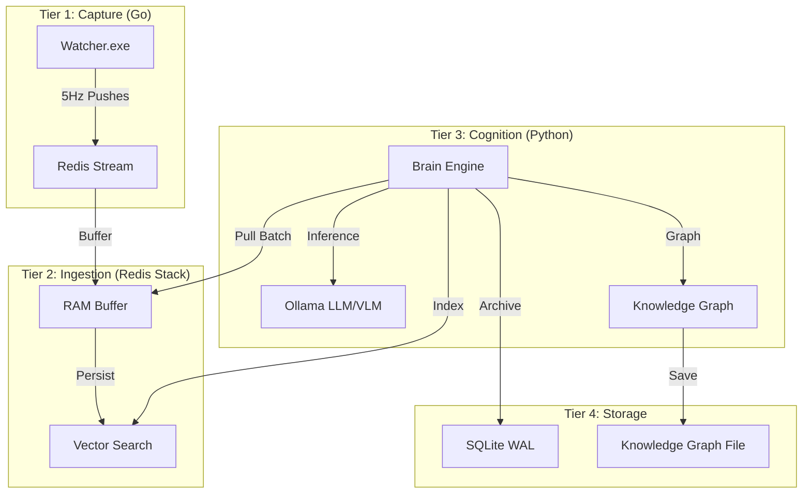

<p align="center">
  
</p>

<h1 align="center">Mnemosyne Core V5.0</h1>

<p align="center">
  <strong>🧠 Local Digital Twin — Enterprise-grade personal analytics with complete data privacy</strong>
</p>
<p align="center">
  <strong>🧠 Локальный Цифровой Двойник — Персональная аналитика корпоративного уровня с полной приватностью</strong>
</p>

<p align="center">
  <a href="#english"><strong>English</strong></a> | <a href="#russian"><strong>Русский</strong></a>
</p>

<p align="center">
  
  
  
  
  
</p>

---

<div id="english"></div>

# 🇬🇧 English Documentation

## 📖 Overview

**Mnemosyne** is an autonomous activity tracking system designed to be your **Local Digital Twin**. It captures, analyzes, and visualizes your entire digital workflow without sending a single byte to the cloud.

Think of it as a self-hosted **Rewind.ai**, but supercharged with **Graph RAG** (Retrieval-Augmented Generation), semantic search, and deep integration with **Obsidian**. It turns your raw activity logs into a queryable knowledge graph.

### Why Mnemosyne?

| Feature | Mnemosyne Core | Cloud Trackers (RescueTime, Rewind) |
|---------|----------------|-------------------------------------|
| **Data Sovereignty** | **100% Local (Air-Gapped)** | Cloud Servers (Privacy Risk) |
| **Intelligence** | **Local LLM (DeepSeek/Llama)** | Black-box Proprietary AI |
| **Search** | **Graph RAG + Semantic** | Keyword / Simple Metadata |
| **Cost** | **Free (Open Source)** | Monthly Subscription |
| **Extensibility** | **Python/Go Source Code** | Closed Ecosystem |

---

## ✨ Key Features

### 1. High-Fidelity Capture (The Watcher)
- **5Hz Polling**: Captures window title, process name, and input intensity every 200ms.
- **Efficient**: Written in Go (Win32 API), consumes <0.1% CPU and <20MB RAM.
- **Smart Idling**: Automatically detects AFK and game modes to pause logging.

### 2. Cognitive Brain (The AI)
- **Local VLM**: Uses `MiniCPM-V` to visually analyze screenshots (OCR + Scene Description).
- **Intent Inference**: Uses `DeepSeek R1` to determine *what* you are doing (e.g., "Debugging Redis Cluster").
- **Session Aggregation**: Groups raw ticks into meaningful sessions (e.g., "Coding Session: 45 mins").

### 3. Graph RAG (The Memory)
- **Vector Search**: Embeds every session description using `nomic-embed-text` into **Redis Stack**.
- **Knowledge Graph**: Builds a topological graph of your activities using **NetworkX**.
- **Queryable**: Ask natural language questions like *"What was I debugging last Friday?"*.

### 4. Enterprise-Grade Architecture
- **Write-Behind Pattern**: Redis acts as a high-speed buffer to protect your SSD from write amplification.
- **Async Processing**: Python workers process data in batches.
- **Maintenance**: Automated VACUUM and pruning scripts.

---

## 🏗️ Architecture



---

## 🚀 Quick Start

### Prerequisites
*   **OS**: Windows 10/11 (Linux/macOS coming soon)
*   **Hardware**: NVIDIA GPU (8GB+ VRAM recommended for local AI)
*   **Software**:
    *   [Docker Desktop](https://www.docker.com/products/docker-desktop/)
    *   [Go 1.25+](https://go.dev/dl/)
    *   [Python 3.12+](https://www.python.org/downloads/)
    *   [Ollama](https://ollama.com/)

### Installation Guide

1.  **Clone the Repository**
    ```powershell
    git clone https://github.com/vel5id/mnemosyne.git
    cd mnemosyne
    ```

2.  **Setup Python Environment**
    ```powershell
    python -m venv .venv
    .venv\Scripts\activate
    pip install -r requirements.txt
    ```

3.  **Build the Watcher (Go)**
    ```powershell
    scripts\build_watcher.bat
    ```

4.  **Launch Infrastructure (Redis Stack)**
    ```powershell
    docker-compose up -d redis
    ```

5.  **Prepare AI Models**
    ```powershell
    ollama pull minicpm-v          # For Vision
    ollama pull deepseek-r1:1.5b  # For Reasoning
    ollama pull nomic-embed-text  # For RAG
    ```

6.  **Initialize Database**
    ```powershell
    scripts\reset_db.bat  # Warning: partial wipe if re-running
    ```

---

## 🕹️ Usage

### 1. Start the System
You need two terminal windows:

**Terminal A (The Eyes): Watcher**
```powershell
scripts\run_watcher.bat
```
*Captures activity and pushes to Redis.*

**Terminal B (The Brain): Analysis Engine**
```powershell
scripts\brain_v4.bat
```
*Consumes from Redis, runs AI analysis, builds sessions, and updates the Graph.*

### 2. Query Your Digital Twin
Use the CLI tools to interact with your data:

**Semantic Search (RAG)**
```powershell
python scripts\query_rag.py "What project did I work on yesterday?"
```

**Find Related Concepts**
```powershell
python scripts\query_rag.py --related "Memory Leak"
```

**View Recent Sessions**
```powershell
python scripts\view_sessions.py
```

### 3. Maintenance
Keep your database healthy (Vacuum, Prune old logs):
```powershell
scripts\maintain_db.bat
```

---

<div id="russian"></div>

# 🇷🇺 Документация на Русском

## 📖 Обзор

**Mnemosyne** — это автономная система трекинга активности, ваш **Локальный Цифровой Двойник**. Она фиксирует, анализирует и визуализирует весь ваш цифровой рабочий процесс, не отправляя ни байта в облако.

Представьте себе self-hosted версию **Rewind.ai**, но с **Graph RAG** (семантическим поиском), локальными нейросетями и интеграцией с **Obsidian**. Она превращает сырые логи активности в базу знаний, которой можно задавать вопросы.

### Почему Mnemosyne?

| Функция | Mnemosyne Core | Облачные трекеры (RescueTime, Rewind) |
|---------|----------------|---------------------------------------|
| **Суверенитет данных** | **100% Локально (Air-Gap)** | Облачные сервера (Риск утечки) |
| **Интеллект** | **Локальные LLM (DeepSeek/Llama)** | Закрытые проприетарные модели |
| **Поиск** | **Graph RAG + Семантика** | Ключевые слова / Метаданные |
| **Цена** | **Бесплатно (Open Source)** | Ежемесячная подписка |
| **Гибкость** | **Исходный код (Python/Go)** | Закрытая экосистема |

---

## ✨ Ключевые Возможности

### 1. Высокоточный Захват (Watcher)
- **Частота 5Hz**: Опрос заголовка окна, процесса и активности ввода каждые 200мс.
- **Эффективность**: Написан на Go (Win32 API), потребляет <0.1% CPU и <20MB RAM.
- **Умный Idle**: Автоматически детектирует простой (AFK) и игровые режимы.

### 2. Когнитивный Мозг (Brain)
- **Локальный VLM**: Использует `MiniCPM-V` для визуального анализа скриншотов (OCR + описание сцены).
- **Определение Намерений**: Использует `DeepSeek R1` для понимания *сути* действия (например, "Отладка Redis кластера").
- **Агрегация Сессий**: Группирует тики в осмысленные сессии (например, "Кодинг сессия: 45 мин").

### 3. Graph RAG (Память)
- **Векторный Поиск**: Эмбеддинг описаний сессий через `nomic-embed-text` в **Redis Stack**.
- **Граф Знаний**: Строит топологический граф активностей через **NetworkX**.
- **Запросы**: Поддерживает вопросы на естественном языке, например *"Что я дебажил в прошлую пятницу?"*.

### 4. Архитектура Enterprise-уровня
- **Write-Behind Pattern**: Redis работает как скоростной буфер, защищая SSD от износа.
- **Асинхронная обработка**: Python-воркеры обрабатывают данные пачками.
- **Обслуживание**: Скрипты для автоматической очистки (VACUUM) и сжатия базы.

---

## 🏗️ Архитектура

*(См. диаграмму в английской секции)*

Система состоит из трех слоев:
1.  **Tier 1 (Сбор)**: Go-приложение считывает состояние Windows API и кидает в Redis Stream.
2.  **Tier 2 (Обработка)**: Python-ядро забирает данные, запускает нейросети (Ollama), строит Граф.
3.  **Tier 3 (Хранение)**: Redis (оперативная память/вектора) и SQLite (долговременный архив).

---

## 🚀 Начало Работы

### Требования
*   **ОС**: Windows 10/11
*   **Железо**: Видеокарта NVIDIA (рекомендуется 8GB+ VRAM)
*   **ПО**: Docker, Go, Python, Ollama.

### Пошаговая Установка

1.  **Клонирование репозитория**
    ```powershell
    git clone https://github.com/vel5id/mnemosyne.git
    cd mnemosyne
    ```

2.  **Настройка Python**
    ```powershell
    python -m venv .venv
    .venv\Scripts\activate
    pip install -r requirements.txt
    ```

3.  **Сборка Watcher (Go)**
    ```powershell
    scripts\build_watcher.bat
    ```

4.  **Запуск Инфраструктуры (Redis)**
    ```powershell
    docker-compose up -d redis
    ```

5.  **Загрузка Нейросетей**
    ```powershell
    ollama pull minicpm-v          # Зрение
    ollama pull deepseek-r1:1.5b  # Мышление
    ollama pull nomic-embed-text  # Память (RAG)
    ```

6.  **Инициализация Базы Данных**
    ```powershell
    scripts\reset_db.bat
    ```

---

## 🕹️ Использование

### 1. Запуск Системы
Вам понадобятся два окна терминала:

**Терминал А (Глаза): Watcher**
```powershell
scripts\run_watcher.bat
```

**Терминал Б (Мозг): Brain**
```powershell
scripts\brain_v4.bat
```

### 2. Запросы к Цифровому Двойнику

**Семантический поиск (RAG)**
```powershell
python scripts\query_rag.py "Над каким проектом я работал вчера?"
```

**Поиск связей**
```powershell
python scripts\query_rag.py --related "Memory Leak"
```

**Просмотр сессий**
```powershell
python scripts\view_sessions.py
```

### 3. Обслуживание
Очистка старых логов и оптимизация БД:
```powershell
scripts\maintain_db.bat
```

---

## 📁 Project Structure / Структура Проекта

```
mnemosyne/
├── cmd/watcher/           # Go Watcher entry point
├── internal/              # Go internal modules
│   ├── monitor/          # 5Hz polling loop
│   ├── storage/          # Redis + SQLite adapters
│   └── heuristics/       # Game/Idle detection
├── core/                  # Python Brain modules
│   ├── aggregation/      # Session tracking logic
│   ├── cognition/        # LLM intent inference
│   ├── perception/       # VLM/OCR processing
│   ├── rag/              # LlamaIndex + NetworkX engine
│   └── dal/              # Database maintenance
├── scripts/              # Batch & Python utility scripts
├── docker/               # Docker configurations
└── db/                   # SQL Schema definitions
```

---

## 📜 License

Distributed under the MIT License. See `LICENSE` for more information.

---

<p align="center">
  <strong>Built with 🧠 by <a href="https://github.com/vel5id">vel5id</a></strong>
</p>
