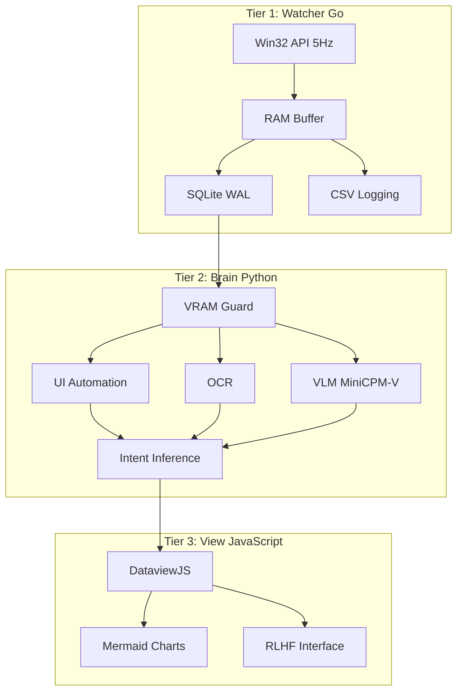

# Mnemosyne Core V3.0

> Локальный Цифровой Двойник (Local Digital Twin) — автономная система персональной аналитики с полной приватностью данных.

## Обзор проекта

Mnemosyne Core V3.0 — это полиглотная архитектура для создания цифрового двойника вашей активности. Система собирает, анализирует и визуализирует контекст работы пользователя без передачи данных во внешние облака (Air-Gap Only).

### Архитектура



### Технологический стек

| Компонент | Технология | Назначение |
|-----------|-----------|-----------|
| **Watcher** | Go 1.22+ | Высокочастотный сбор данных (5Hz), Win32 API |
| **Brain** | Python 3.12.7 | AI анализ, OCR, VLM, инференс намерений |
| **View** | JavaScript (DataviewJS) | Визуализация в Obsidian |
| **Database** | SQLite (WAL) | Хранение данных, конкурентный доступ |

## Требования к системе

### Железо
- **GPU**: NVIDIA RTX 5060 Ti (8-16GB VRAM)
- **RAM**: 80GB (рекомендуется для агрессивного кэширования)
- **SSD**: NVMe для SQLite WAL
- **OS**: Windows 10/11

### Программное обеспечение
- Go 1.22+
- Python 3.12.7
- Obsidian с плагином Dataview

## Установка

### 1. Клонирование репозитория

```bash
git clone https://github.com/your-repo/mnemosyne-core.git
cd mnemosyne-core
```

### 2. Установка зависимостей Go

```bash
go mod download
```

### 3. Установка зависимостей Python

```bash
python -m venv venv
venv\Scripts\activate  # Windows
pip install -r requirements.txt
```

### 4. Конфигурация

```bash
# Копирование примеров конфигурации
copy config\watcher.yaml.example config\watcher.yaml
copy config\brain.yaml.example config\brain.yaml
copy .env.example .env

# Редактирование конфигурации
notepad config\watcher.yaml
notepad config\brain.yaml
notepad .env
```

### 5. Настройка Obsidian

1. Установите плагин Dataview в Obsidian
2. Создайте папку `Mnemosyne/Logs` в вашем vault
3. Добавьте путь к vault в `.env`

## Использование

### Запуск Watcher (Go)

```bash
go run cmd/watcher/main.go
```

Или скомпилированный бинарник:

```bash
go build -o watcher.exe cmd/watcher/main.go
watcher.exe
```

### Запуск Brain (Python)

```bash
python scripts/main.py
```

### Интеграция с Obsidian

Добавьте в вашу Daily Note следующий код DataviewJS:

```javascript
```dataviewjs
const { MnemosyneDashboard } = await dv.view('Scripts/Mnemosyne/mnemosyne_dashboard.js');
MnemosyneDashboard.render(dv, app);
```
```

## Структура проекта

```
mnemosyne-core/
├── cmd/watcher/          # Точка входа Watcher
├── internal/             # Внутренние модули Go
│   ├── win32/          # Win32 API обертки
│   ├── monitor/        # Главный цикл 5Hz
│   ├── sensors/        # Сбор метрик
│   ├── heuristics/    # Детекция игр, idle
│   ├── buffer/         # RAM буфер
│   └── storage/       # SQLite взаимодействие
├── pkg/models/          # Общие структуры данных
├── scripts/            # Python модули
│   ├── core/
│   │   ├── dal/           # Database Access Layer
│   │   ├── perception/     # OCR, VLM, UIA
│   │   ├── cognition/      # Intent inference
│   │   ├── security/      # PII sanitization
│   │   ├── system/        # VRAM Guard
│   │   └── export/        # Obsidian bridge
│   └── Mnemosyne/       # JavaScript скрипты
├── db/                  # SQL схемы и миграции
├── config/              # Конфигурационные файлы
├── .mnemosyne/          # Рабочие данные (скрыто)
│   ├── activity.db
│   ├── logs/
│   └── screenshots/
└── docs/               # Архитектурная документация
```

## Безопасность и приватность

### Air-Gap Принцип
- Нет внешних API вызовов
- Все вычисления локальные
- Блокировка исходящего трафика в Firewall

### Защита PII
- Автоматическая санитизация данных (Regex)
- Маскировка email, IP, кредитных карт, API ключей

### Шифрование (опционально)
- SQLCipher для AES-256 шифрования базы данных

## Производительность

### Watcher (Go)
- **CPU**: < 0.1%
- **RAM**: < 20MB
- **Polling**: 5Hz (200ms)

### Brain (Python)
- **VRAM**: Динамическое управление (Guard)
- **Batch Processing**: 50-100 событий за раз
- **Model Swapping**: Загрузка/выгрузка по необходимости

## Лицензия

MIT License

## Документация

Подробная архитектура доступна в папке [`docs/`](docs/):
- [Watcher Go Architecture](docs/01_Watcher_Go_Arch.md)
- [Brain Python Architecture](docs/02_Brain_Python_Arch.md)
- [View JS Architecture](docs/03_View_JS_Arch.md)
- [SQL Schema](docs/04_SQL_Schema.md)
- [Telemetry Overview](docs/05_Telemetry_Overview.md)

## Вклад в проект

1. Fork репозитория
2. Создайте feature branch
3. Commit ваши изменения
4. Push в branch
5. Откройте Pull Request
