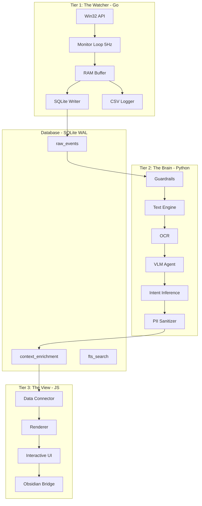

# Mnemosyne Core V3.0 - ROADMAP

## Обзор проекта

Mnemosyne Core V3.0 — это система "Локального Цифрового Двойника" (Local Digital Twin), реализующая событийно-ориентированную полиглот-архитектуру для мониторинга и анализа пользовательской активности с полной приватностью и локальной обработкой данных.

### Архитектурная модель (Polyglot V3.0)

---

## Этап 1: Database (База данных)

### Цель
Создать и настроить SQLite базу данных в режиме WAL для конкурентного доступа между Go (Writer) и Python (Reader).

### Задачи

#### 1.1 Инициализация схемы базы данных
- [ ] Создать файл `db/init_schema.sql` с DDL для всех таблиц
- [ ] Создать таблицу `raw_events` (сырые события от Watcher)
- [ ] Создать таблицу `context_enrichment` (обогащенный контекст от Brain)
- [ ] Создать виртуальную таблицу `fts_search` (FTS5 для полнотекстового поиска)
- [ ] Создать индексы для оптимизации запросов
- [ ] Создать триггеры для синхронизации FTS5

#### 1.2 Конфигурация PRAGMA
- [ ] Настроить `journal_mode = WAL`
- [ ] Настроить `synchronous = NORMAL` (защита SSD)
- [ ] Настроить `temp_store = MEMORY` (использование 80GB RAM)
- [ ] Настроить `mmap_size = 268435456` (256MB Memory-Mapped I/O)
- [ ] Настроить `busy_timeout = 5000` (ожидание при блокировках)

#### 1.3 Скрипт инициализации
- [ ] Создать скрипт `db/init_db.py` для создания и настройки БД
- [ ] Добавить валидацию схемы при запуске
- [ ] Создать миграции для будущих обновлений

---

## Этап 2: Watcher (Go - Tier 1)

### Цель
Реализовать высокопроизводительный модуль сбора данных на Go с частотой 5Hz, потребляющий <20MB RAM и <0.1% CPU.

### Задачи

#### 2.1 Пакет /cmd/watcher (Точка входа)
- [ ] Создать `main.go` с инициализацией конфигурации
- [ ] Реализовать перехват OS сигналов (SIGTERM, Interrupt)
- [ ] Реализовать грациозное завершение с сбросом буфера
- [ ] Настроить логирование

#### 2.2 Пакет /pkg/models (Общие структуры)
- [ ] Создать `models.go` со структурой `LogEntry`
- [ ] Создать структуру `Config` для настроек
- [ ] Создать структуры для метрик

#### 2.3 Пакет /internal/win32 (Win32 API обертки)
- [ ] Реализовать `GetForegroundWindow` через syscall
- [ ] Реализовать `GetWindowThreadProcessId`
- [ ] Реализовать `GetWindowTextW` с sync.Pool для буферов
- [ ] Реализовать `GetLastInputInfo` для Input Intensity
- [ ] Реализовать `SHQueryUserNotificationState` для детекции игр
- [ ] Реализовать `GetWindowRect` для ROI координат

#### 2.4 Пакет /internal/sensors (Сбор метрик)
- [ ] Создать модуль для извлечения заголовка окна
- [ ] Создать модуль для определения имени процесса
- [ ] Создать модуль для расчета Input Intensity
- [ ] Создать модуль для определения ROI (Region of Interest)

#### 2.5 Пакет /internal/heuristics (Анализ состояния)
- [ ] Реализовать детекцию Game Mode (QUNS_RUNNING_D3D_FULL_SCREEN)
- [ ] Реализовать детекцию Idle состояния (>60 сек бездействия)
- [ ] Реализовать расчет интенсивности ввода
- [ ] Создать черный список процессов (игры, рендеринг)

#### 2.6 Пакет /internal/buffer (Управление RAM)
- [ ] Реализовать кольцевой буфер (Ring Buffer) на 1000-1500 событий
- [ ] Реализовать политику сброса (Flush Policy):
  - Capacity Threshold: 500 записей
  - Time Threshold: 5 минут
  - Signal Trap: при завершении работы
- [ ] Обеспечить thread-safety через sync.RWMutex

#### 2.7 Пакет /internal/storage (SQLite взаимодействие)
- [ ] Инициализировать драйвер mattn/go-sqlite3
- [ ] Настроить PRAGMA директивы при соединении
- [ ] Реализовать Batch Insert с BEGIN IMMEDIATE TRANSACTION
- [ ] Реализовать Prepared Statements для производительности
- [ ] Настроить SetMaxOpenConns(1) для единственного писателя

#### 2.8 Пакет /internal/monitor (Основной цикл)
- [ ] Реализовать Ticker Loop с частотой 5Hz (200ms)
- [ ] Реализовать функцию `tick()` с бюджетом времени <10ms
- [ ] Реализовать Gaming Guard (первый эшелон защиты)
- [ ] Реализовать Idle Check
- [ ] Реализовать дедупликацию событий (сравнение HWND и Title)
- [ ] Реализовать Fan-In паттерн для параллельной записи

#### 2.9 Параллельное логирование (CSV)
- [ ] Интегрировать библиотеку lumberjack v2
- [ ] Настроить ротацию логов (10MB, 10 бэкапов, 28 дней)
- [ ] Реализовать обертку для записи CSV заголовков при ротации
- [ ] Реализовать неблокирующую запись через каналы

#### 2.10 Тестирование
- [ ] Написать unit-тесты для модуля buffer
- [ ] Написать unit-тесты для модуля win32
- [ ] Написать интеграционные тесты для storage
- [ ] Провести нагрузочное тестирование 5Hz цикла

---

## Этап 3: Brain (Python - Tier 2)

### Цель
Реализовать асинхронный аналитический конвейер на Python для семантической обработки данных с VRAM Guard и PII Sanitization.

### Задачи

#### 3.1 Пакет core/dal (Data Access Layer)
- [ ] Создать `sqlite_provider.py` с aiosqlite
- [ ] Реализовать `fetch_pending_events(batch_size=100)`
- [ ] Реализовать `update_event_context(event_id, context_data)`
- [ ] Реализовать `get_history_tail(timestamp, window_seconds=60)`
- [ ] Настроить PRAGMA директивы для конкурентного чтения

#### 3.2 Пакет core/system (Управление ресурсами)
- [ ] Создать `guardrails.py` с VRAM Guard
- [ ] Реализовать проверку через pynvml (nvmlDeviceGetMemoryInfo)
- [ ] Реализовать детекцию полноэкранного режима
- [ ] Реализовать сканирование процессов (черный список)
- [ ] Создать логику "Smart Full Stop"

#### 3.3 Пакет core/perception (Слой восприятия)
- [ ] Создать `text_engine.py` для UI Automation
  - Интегрировать библиотеку uiautomation
  - Реализовать дамп Accessibility Tree
  - Реализовать Live/Fallback режимы
- [ ] Создать `ocr.py` для оптического распознавания
  - Интегрировать Tesseract (CPU)
  - Интегрировать EasyOCR (GPU, опционально)
  - Реализовать гибридный подход
- [ ] Создать `vision_agent.py` для VLM
  - Интегрировать MiniCPM-V 2.6 Int4
  - Реализовать загрузку/выгрузку модели (Residency Strategy)
  - Реализовать пакетный инференс (Batch Inference)
  - Реализовать обрезку изображений по ROI

#### 3.4 Пакет core/cognition (Когнитивный анализ)
- [ ] Создать `inference.py` для синтеза намерений
  - Реализовать Prompt Engineering (hardcoded system prompt)
  - Реализовать слияние сигналов (Context Layer Cake)
  - Реализовать формирование WikiLinks
  - Реализовать генерацию тегов

#### 3.5 Пакет core/security (Безопасность)
- [ ] Создать `sanitizer.py` для PII Sanitization
  - Реализовать паттерн для Email
  - Реализовать паттерн для IP-адресов
  - Реализовать паттерн для кредитных карт
  - Реализовать паттерн для API ключей (sk-, ghp-, AKIA)

#### 3.6 Пакет core/export (Экспорт)
- [ ] Создать `obsidian_bridge.py`
  - Реализовать определение пути к Vault
  - Реализовать ротацию Daily Notes (YYYY-MM-DD.md)
  - Реализовать атомарную запись с flush/fsync

#### 3.7 Главный цикл (main.py)
- [ ] Реализовать Event Loop
- [ ] Интегрировать Guard check
- [ ] Реализовать Batch Processing
- [ ] Реализовать Load/Unload Models стратегию
- [ ] Реализовать Commit (пометка processed)

#### 3.8 Тестирование
- [ ] Написать тесты для sanitizer.py
- [ ] Написать тесты для guardrails.py
- [ ] Провести тестирование VRAM Guard на RTX 5060 Ti
- [ ] Провести интеграционные тесты с SQLite

---

## Этап 4: View (JavaScript - Tier 3)

### Цель
Реализовать интерактивный интерфейс в Obsidian с визуализацией данных, Mermaid диаграммами и механизмом RLHF.

### Задачи

#### 4.1 Модуль Data Ingestion (mnemosyne_data_connector.js)
- [ ] Создать класс `MnemosyneData`
- [ ] Реализовать `getDailyLog(date)` - агрегация логов за день
- [ ] Реализовать `getProjectContext(projectName)` - контекст проекта
- [ ] Реализовать мемоизацию для кэширования
- [ ] Использовать Dataview API (dv.pages) для производительности

#### 4.2 Модуль Renderer (mnemosyne_renderer.js)
- [ ] Реализовать `renderTimeline(events)` - генерация Mermaid Gantt
- [ ] Реализовать агрегацию коротких событий (Micro-tasks)
- [ ] Реализовать генерацию Context Cards
- [ ] Реализовать тепловую карту интенсивности (Heatmap)
- [ ] Реализовать цветовое кодирование по категориям приложений

#### 4.3 Модуль Interact (mnemosyne_interact.js)
- [ ] Реализовать кнопки "Flag Error" и "Correct"
- [ ] Реализовать модальное окно для коррекции
- [ ] Реализовать транзакционную запись через processFrontMatter
- [ ] Реализовать перемещение в Training/Dataset

#### 4.4 Модуль Dashboard (mnemosyne_dashboard.js)
- [ ] Реализовать инициализацию и маршрутизацию
- [ ] Реализовать секцию "Deep Work Timeline"
- [ ] Реализовать секцию "Activity Stream"
- [ ] Реализовать обработку ошибок (try-catch)

#### 4.5 Модуль Actions (flag_entry.js)
- [ ] Реализовать логику флагирования записи
- [ ] Реализовать обновление метаданных
- [ ] Реализовать уведомления (Notice)
- [ ] Реализовать обновление UI без перезагрузки

#### 4.6 Модуль Core (mnemosyne_core.js)
- [ ] Реализовать `getHighLevelSummary(date)`
- [ ] Реализовать `redactPII(text)` - защита на лету
- [ ] Реализовать `formatDuration(ms)` - утилита форматирования

#### 4.7 Интеграция с Obsidian
- [ ] Настроить доступ к скрытым папкам через app.vault.adapter
- [ ] Реализовать чтение параллельных CSV логов
- [ ] Интегрировать с DataviewJS
- [ ] Настроить Mermaid.js рендеринг

---

## Конфигурационные файлы

### Go (go.mod)
- [ ] Создать `go.mod` с Go 1.22+
- [ ] Добавить зависимость `github.com/mattn/go-sqlite3`
- [ ] Добавить зависимость `gopkg.in/natefinch/lumberjack.v2`
- [ ] Добавить зависимость `golang.org/x/sys/windows`

### Python (requirements.txt)
- [ ] Создать `requirements.txt` с Python 3.12.7
- [ ] Добавить `aiosqlite`
- [ ] Добавить `pynvml`
- [ ] Добавить `uiautomation`
- [ ] Добавить `pytesseract`
- [ ] Добавить `easyocr` (опционально)
- [ ] Добавить `torch`
- [ ] Добавить `transformers`
- [ ] Добавить `accelerate`
- [ ] Добавить `bitsandbytes`
- [ ] Добавить `pillow`
- [ ] Добавить `psutil`

### Конфигурации
- [ ] Создать `config/watcher.yaml` для настроек Watcher
- [ ] Создать `config/brain.yaml` для настроек Brain
- [ ] Создать `.env.example` для переменных окружения

---

## Дополнительные задачи

### Структура проекта
- [ ] Создать директорию `pkg/models/` для Go
- [ ] Создать директорию `db/` для SQL схем
- [ ] Создать директорию `config/` для конфигов
- [ ] Создать директорию `logs/` для CSV логов
- [ ] Создать директорию `screenshots/` для скриншотов
- [ ] Создать директорию `.mnemosyne/` для скрытых данных

### Документация
- [ ] Создать `.gitignore`
- [ ] Создать `README.md`
- [ ] Создать `docs/API.md` для описания API
- [ ] Создать `docs/DEPLOYMENT.md` для инструкций по развертыванию

### Безопасность
- [ ] Настроить SQLCipher для шифрования БД
- [ ] Создать инструкции для Windows Firewall (Air-Gap)
- [ ] Реализовать проверку зависимостей (supply-chain security)

---

## Порядок реализации

Рекомендуемый порядок реализации для обеспечения работоспособности системы:

1. **Database** → Базис для всех компонентов
2. **Watcher** → Источник данных
3. **Brain** → Обработка данных
4. **View** → Визуализация

Каждый этап должен быть полностью протестирован перед переходом к следующему.
