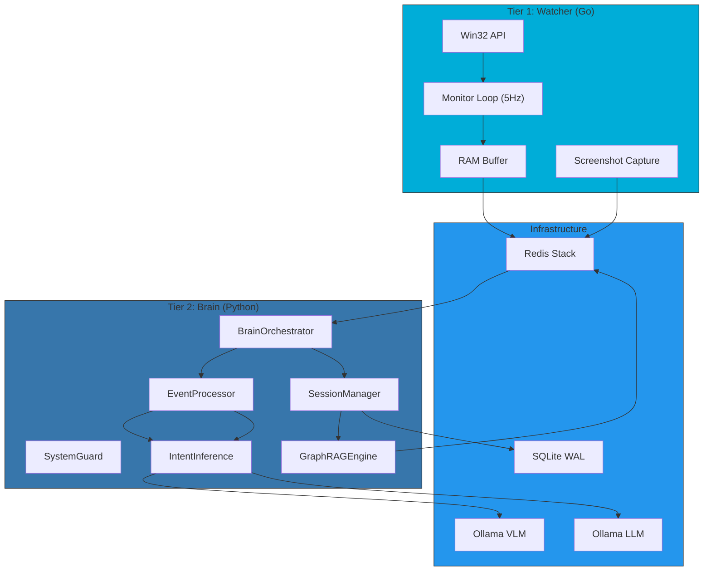
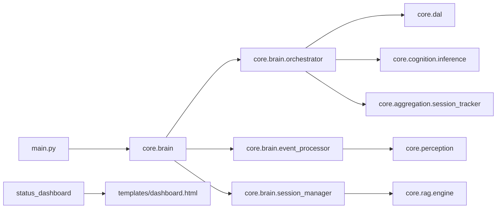

# 🏛️ Mnemosyne Repository Blueprint

> **Version**: 5.1 | **Last Updated**: 2026-01-19  
> **Status**: Active Development | **Architecture**: Polyglot (Go + Python)

---

## 1. Executive Summary

Mnemosyne is a **Local Digital Twin** system for autonomous activity tracking with complete data privacy. It implements a polyglot event-driven architecture with three tiers:

| Tier | Language | Purpose |
|------|----------|---------|
| **Watcher** | Go 1.24 | High-frequency capture (5Hz), Win32 API |
| **Brain** | Python 3.12 | AI analysis, session tracking, Graph RAG |
| **View** | JavaScript | Dashboard, Obsidian integration |

---

## 2. Live Architecture Map

---

## 3. Component Inventory

### 3.1 Brain Package (`core/brain/`) — ✅ NEW

| Module | LOC | Purpose |
|--------|-----|---------|
| `orchestrator.py` | 380 | Lifecycle, event loop, coordination |
| `event_processor.py` | 230 | VLM/OCR, intent inference pipeline |
| `session_manager.py` | 260 | Session archival, RAG indexing |
| `__init__.py` | 22 | Facade (exports `Brain`) |

### 3.2 Core Modules (`core/`)

| Module | LOC | Purpose | Risk |
|--------|-----|---------|------|
| `cognition/inference.py` | 606 | LLM intent inference | ⚠️ High |
| `rag/engine.py` | 395 | Graph RAG | Medium |
| `perception/vision_agent.py` | ~300 | VLM analysis | Medium |
| `aggregation/session_tracker.py` | ~200 | Session grouping | Low |

### 3.3 DAL Package (`core/dal/`) — ✅ Decomposed

| Module | LOC | Purpose |
|--------|-----|---------|
| `base.py` | 145 | Connection, PRAGMA, lock |
| `events.py` | 310 | Raw events CRUD |
| `context.py` | 125 | Context enrichment |
| `sessions.py` | 185 | Session aggregation |
| `stats.py` | 125 | Analytics queries |
| `sqlite_provider.py` | 185 | Facade |

### 3.3 Go Modules (`internal/`)

| Module | Size | Purpose |
|--------|------|---------|
| `monitor/monitor.go` | 13.5KB | Main 5Hz polling loop |
| `storage/sqlite.go` | 4.9KB | SQLite writer |
| `storage/redis_client.go` | 1.3KB | Redis stream publisher |
| `buffer/buffer.go` | ~2KB | Ring buffer |

### 3.4 Entry Points

| File | LOC | Status |
|------|-----|--------|
| `main.py` | 52 | ✅ Slim (imports `core.brain`) |
| `status_dashboard.py` | 455 | ✅ Template extracted |
| `cmd/watcher/main.go` | ~100 | ✅ Stable |

---

## 4. Dependency Graph

**Verdict**: Clean layered architecture. Brain decomposed into focused modules.

---

## 5. Technical Debt Registry

| ID | Component | Issue | Priority | Status |
|----|-----------|-------|----------|--------|
| ~~TD-001~~ | `main.py` | Brain [[God Object]] | High | ✅ RESOLVED |
| ~~TD-002~~ | `status_dashboard.py` | Embedded HTML | Medium | ✅ RESOLVED |
| ~~TD-003~~ | `sqlite_provider.py` | 21 methods in single class | Medium | ✅ RESOLVED |
| TD-004 | `inference.py` | Hardcoded prompts | Low | 🔲 Open |
| TD-005 | Docker | Brain service commented | Low | 🔲 Open |
| ~~TD-006~~ | `dal/__init__.py` | Missing facade | Medium | ✅ RESOLVED |

---

## 6. Evolution Roadmap

### ✅ Phase Bridge (Completed)
- [x] Extract HTML to `templates/dashboard.html`
- [x] Create `core/dal/__init__.py` facade

### ✅ Phase Transition (Completed)  
- [x] Decompose Brain → `BrainOrchestrator`, `EventProcessor`, `SessionManager`
- [x] Create `core/brain/` package with clean separation

### 🔲 Phase Consolidation (Next)
1. [ ] Decompose `sqlite_provider.py` into reader/writer modules (TD-003)
2. [ ] Extract prompts to `config/prompts/` YAML files (TD-004)
3. [ ] Enable Brain Docker container (TD-005)

### 🔲 Phase Target (Long-term)
1. [ ] Clean Architecture with explicit domain boundaries
2. [ ] OpenTelemetry tracing for cross-tier observability
3. [ ] Plugin system for perception modules

---

## 7. Architectural Decisions

### Why Polyglot?
- **Go Watcher**: Sub-millisecond Win32 syscalls, <20MB RAM
- **Python Brain**: Rich AI/ML ecosystem (LlamaIndex, NetworkX)

### Why Redis Stack?
- Streams for event ingestion
- VectorStore for embeddings
- Built-in persistence

### Why Local LLMs?
- 100% air-gap capable
- No API costs
- Full data privacy

---

## 8. Metrics Comparison

| Metric | Before | After | Δ |
|--------|--------|-------|---|
| `main.py` | 665 lines | 52 lines | **-92%** |
| `status_dashboard.py` | 808 lines | 455 lines | **-44%** |
| Brain package | (monolith) | 4 modules | **+SRP** |
| Tech debt items | 6 open | 3 open | **-50%** |

---

> **🏛️ Argus Note**: Blueprint updated after successful Bridge and Transition refactoring. Next focus: TD-003 (sqlite_provider decomposition).
