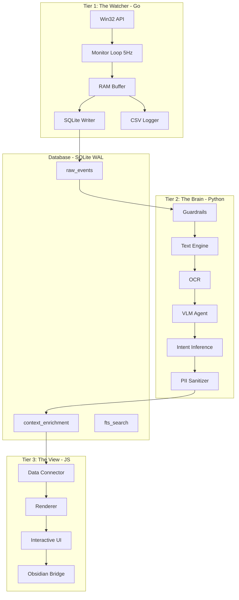

# README.md Plan

Содержимое для `README.md`:

```markdown
# Mnemosyne Core V3.0

**Локальный Цифровой Двойник** (Local Digital Twin) — система мониторинга и анализа пользовательской активности с полной приватностью и локальной обработкой данных.

## Обзор

Mnemosyne Core — это событийно-ориентированная полиглот-архитектура (Polyglot V3.0), которая реконструирует контекст работы пользователя с высокой точностью без использования облачных сервисов.

### Архитектура



### Технический стек

| Компонент | Технология | Назначение |
|-----------|-------------|-------------|
| **Tier 1** | Go 1.22+ | Сбор данных, Win32 API, 5Hz опрос |
| **Tier 2** | Python 3.12.7 | AI анализ, OCR, VLM (MiniCPM-V Int4) |
| **Tier 3** | JavaScript (DataviewJS) | Визуализация в Obsidian |
| **Database** | SQLite (WAL Mode) | Хранение данных, конкурентный доступ |

## Возможности

- **High-Frequency Monitoring**: Опрос системы на частоте 5Hz с потреблением <20MB RAM
- **Smart Full Stop**: Автоматическая приостановка при детекции игр
- **VRAM Guard**: Защита видеокарты от перегрузки (проверка через pynvml)
- **PII Sanitization**: Автоматическое удаление чувствительных данных (Email, IP, API ключи)
- **Context Layer Cake**: Многослойный анализ (UI Automation → OCR → VLM)
- **Parallel Logging**: Дуальная запись в SQLite WAL и CSV с ротацией
- **Air-Gap Privacy**: Полная изоляция от внешних API

## Системные требования

### Оборудование
- **OS**: Windows 10/11
- **CPU**: Любой современный процессор
- **GPU**: NVIDIA RTX 5060 Ti (или совместимая)
- **RAM**: 80GB (рекомендуется для кэширования)
- **SSD**: NVMe для оптимальной производительности

### Программное обеспечение
- **Go**: 1.22+
- **Python**: 3.12.7
- **Obsidian**: 1.5+ (с плагином Dataview)
- **Tesseract**: для OCR (опционально)

## Установка

### 1. Клонирование репозитория

```bash
git clone https://github.com/mnemosyne/core.git
cd core
```

### 2. Настройка окружения

```bash
# Python venv
python -m venv venv
venv\Scripts\activate  # Windows
pip install -r requirements.txt

# Go modules
go mod download
```

### 3. Конфигурация

```bash
# Скопировать и отредактировать конфиги
cp config/watcher.yaml.example config/watcher.yaml
cp config/brain.yaml.example config/brain.yaml
cp .env.example .env
```

### 4. Инициализация базы данных

```bash
python scripts/core/dal/init_db.py
```

## Использование

### Запуск Watcher (Go)

```bash
go run cmd/watcher/main.go
```

### Запуск Brain (Python)

```bash
python scripts/main.py
```

### Интеграция с Obsidian

Скопировать скрипты из `scripts/Mnemosyne/` в папку `.obsidian/plugins/` вашего vault.

## Структура проекта

```
mnemosyne-core/
├── cmd/watcher/          # Точка входа Watcher
├── internal/              # Внутренние пакеты Go
│   ├── win32/           # Win32 API обертки
│   ├── monitor/         # Основной цикл 5Hz
│   ├── sensors/          # Сбор метрик
│   ├── heuristics/      # Анализ состояния
│   ├── buffer/          # Управление RAM
│   └── storage/         # SQLite взаимодействие
├── pkg/models/           # Общие структуры данных
├── scripts/              # Python модули
│   ├── core/
│   │   ├── dal/         # Data Access Layer
│   │   ├── perception/  # OCR, VLM, UI Automation
│   │   ├── cognition/   # Intent Inference
│   │   ├── security/    # PII Sanitization
│   │   ├── system/      # Guardrails, VRAM Guard
│   │   └── export/      # Obsidian Bridge
│   └── Mnemosyne/      # JS скрипты для Obsidian
├── db/                  # SQL схемы
├── config/               # Конфигурационные файлы
├── docs/                 # Архитектурная документация
└── .mnemosyne/           # Скрытые данные (БД, логи)
```

## Документация

- [ROADMAP.md](ROADMAP.md) — Детальный план реализации
- [docs/01_Watcher_Go_Arch.md](docs/01_Watcher_Go_Arch.md) — Архитектура Watcher
- [docs/02_Brain_Python_Arch.md](docs/02_Brain_Python_Arch.md) — Архитектура Brain
- [docs/03_View_JS_Arch.md](docs/03_View_JS_Arch.md) — Архитектура View
- [docs/04_SQL_Schema.md](docs/04_SQL_Schema.md) — Схема базы данных
- [docs/05_Telemetry_Overview.md](docs/05_Telemetry_Overview.md) — Обзор телеметрии

## Безопасность

- **Air-Gap**: Все вычисления локальные, без внешних API
- **PII Sanitization**: Автоматическое удаление чувствительных данных
- **SQLCipher**: Опциональное шифрование базы данных
- **Firewall**: Рекомендуется блокировать исходящий трафик

## Лицензия

MIT License — см. файл LICENSE

## Контакты

- GitHub: https://github.com/mnemosyne/core
- Issues: https://github.com/mnemosyne/core/issues
```
